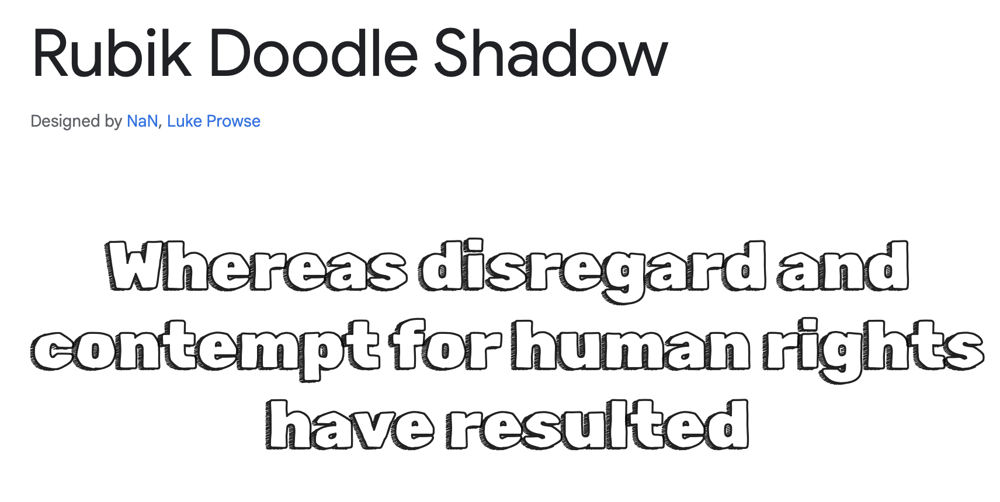
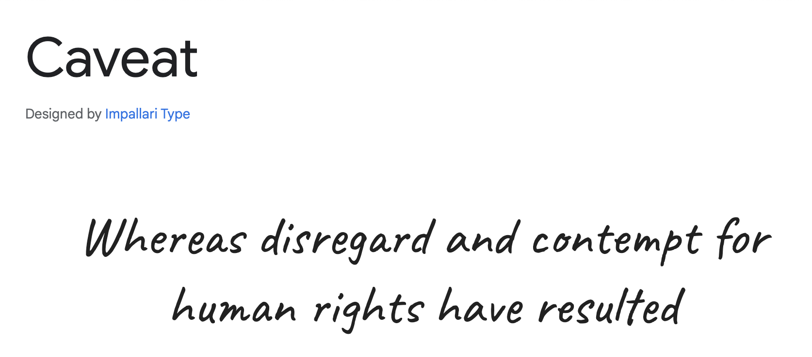
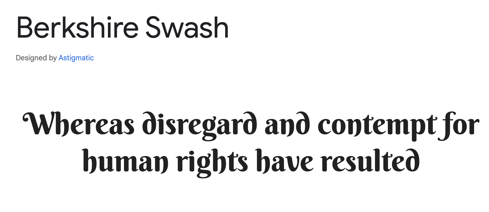

<h1 align= "center"> Festive Quiz Game | Christmas 2023</h1>

[Click for live view](https://flashdrag.github.io/festive-quiz-game/)

## Table of Contents

Click to go to Contents here 

[About the project](#about-the-project) 
- [Initial Concept](#Initial-Concept)
    - [Wireframes](#Wireframes)
    - [Colour Scheme](#Colour-Scheme)
    - [Imagery](#Imagery)

[Target audience](#target-audience)

[User Experience UX](#user-experience-ux)

 - [User stories](#user-stories)
 - [Design](#design)

[Typography](#typography)
- [Background](#background)
- [Fonts](#fonts)

[Features](#features)

 - [Composition of the Website](#composition-of-the-website)
 - [Navbar](#navbar)
 - [Animations](#animations)
 - [Footer](#footer)

[Future feature](#future-feature)

[Technology used](#technology-used)

[Tools](#tools)

[Testing](#testing)
 - [Lighthouse](#lighthouse-report)
 - [Manual testing](#manual-testing)
 - [Test on browsers](#test-on-browsers)
 
[Deployment](#deployment)
 
[Fixed Bugs](#fixed-bugs)

[Credits](#credits)
 - [Conclusion](#conclusion)

[Acknowledgements](#acknowledgements)

## About the project

Festive Quiz Game is an interactive website that caters to users who enjoy learning more about the Christmas holiday. The website is created with the intention of bringing joy, merriment, and a sprinkle of festive magic into the digital world. Its aim is to allow users to fully immerse themselves in the Christmas spirit through a specially curated Christmas Fun Quiz.
The purpose of the website is to provide users with a way to take a break from their daily routine. The quiz on the website is an ideal way for users to unwind, relax, and refresh their minds during the holiday season. It offers users a chance to test their knowledge of Christmas traditions, history, and pop culture in a fun, interactive, and enjoyable way.

## Objectives

  - The main goal of the player is to assist Santa in delivering gifts to children from the North Pole by answering Christmas-related questions. For every correct answer, Santa moves closer to his final destination. The quiz consists of three levels of difficulty - Easy, Medium, and Hard. Each level has a different number of attempts, and the user will experience a unique end animation when they successfully complete each level.

## Target audience

## Initial Concept

### Wireframes

  - The design of the website was a collaborative effort from the team assigned to build  it. Different ideas were suggested on where each content should be placed on the page. As a result, the team decided to have different designs, which may have subtle changes as the building progresses.

  Below are some images of the wireframes:

  - Homepage wireframe
  

  - Game area wireframe option 1.
  

  - Game area wireframe option 2.
  

  - Game area wireframe option 3.
  

***

## User Experience (UX)

### User Stories

  - To be able to view the site on a range of device sizes.
  - To facilitate simultaneous navigation for users during the quiz.
  - To ensure that users experience high-performance interactivity while playing the game.

#### First Time Visitor Goal

  - I want to find out about the Festive Quiz Game and if I can access the levels of the  game.
  - I want to easily navigate the site and access different parts of the game.
  - I would like to know what gift is presented at the end of the game.

#### Returning Visitor Goal

  - I want to know what improvements have been made to the game and what are the different levels.
  - I want to play more to achieve more Santa gifts.

#### Frequent Visitor Goal

  - I want to recommend the Festive Quiz Game for my loved ones to enjoy during the holidays.

## Design

### Color Scheme

In order for users to fully immerse themselves in the moment and the season, we have chosen colors that reflect the themes of love and harmony, as well as the festive atmosphere of Christmas. Our color palette includes a variety of shades that capture these feelings and emotions. The colors are: Venetian Red, Carmine Pink, Light Yellow, and Menthol.
These colors are all reflected in the background image.

### Typography

- #### Background
  A background image with Christmas theme was added to the webpage to give a 3D effect and make the heading area look more interactive. The homepage features an animated background theme with a woodfire effect to create a cozy and warm atmosphere of Christmas.
  As users might expect, they want to feel immersed in the Christmas atmosphere, so the team opted for a background that is visually appealing and gives the right impression.

- #### Fonts

  

  - Rubik Doodle Shadow font

  

  - Caveat font

  

  - Berkshire Swash font

  The chosen fonts for the website were imported using Google Fonts.
  
  After careful consideration, the team decided to use the fonts Caveat, Rubik Doodle Shadow and Berkshire Swash for the text on screens of all sizes. We believe that these fonts offer a great combination of aesthetic appeal and readability, and will help to enhance the overall user experience.

***

## Features

### Composition of the Website

  The website is organized into two distinct web pages such as the Homepage and the Game Page; the Game Page is accessible through a link in the New Game Button Bar at the center of the Homepage. Users can easily navigate to the Game Difficulty Menu where there are three option bars to select a difficulty level, after selecting a difficulty level, the Topic Menu is next; In the Topic Menu, the users have access to four distinc Topics such as Christmas Trivia, Christmas Movies, Christmas Music, and Christmas Food where they have the choices to select what topic they would like to answer and have fun with; clicking on the topic bar takes the user swiftly to the Game Page. The website's structure provides a smooth and efficient user experience.

***

## Technologies Used

***

## Testing

### Validator Testing

## Credits

