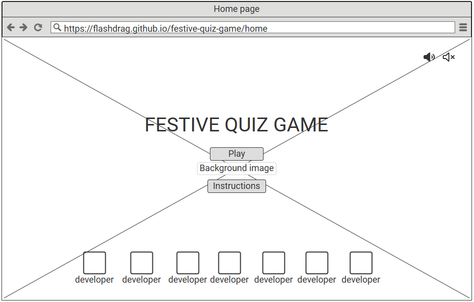

<h1 align= "center"> Festive Quiz Game | Christmas 2023</h1>

[Click for live view](https://)

## Table of Contents

Click to go to Contents here 

[About the project](#about-the-project) 
- [Initial Concept](#Initial-Concept)
    - [Wireframes](#Wireframes)
    - [Colour Scheme](#Colour-Scheme)
    - [Imagery](#Imagery)

[Target audience](#target-audience)

[User Experience UX](#user-experience-ux)

 - [User stories](#user-stories)
 - [Design](#design)

[Typography](#typography)
- [Background](#background)
- [Fonts](#fonts)

[Features](#features)

 - [Composition of the Website](#composition-of-the-website)
 - [Navbar](#navbar)
 - [Animations](#animations)
 - [Footer](#footer)

[Future feature](#future-feature)

[Technology used](#technology-used)

[Tools](#tools)

[Testing](#testing)
 - [Lighthouse](#lighthouse-report)
 - [Manual testing](#manual-testing)
 - [Test on browsers](#test-on-browsers)
 
[Deployment](#deployment)
 
[Fixed Bugs](#fixed-bugs)

[Credits](#credits)
 - [Conclusion](#conclusion)

[Acknowledgements](#acknowledgements)

## About the project

Festive Quiz Game is an interactive website that caters to users who enjoy learning more about the Christmas holiday. The website is created with the intention of bringing joy, merriment, and a sprinkle of festive magic into the digital world. Its aim is to allow users to fully immerse themselves in the Christmas spirit through a specially curated Christmas Fun Quiz.
The purpose of the website is to provide users with a way to take a break from their daily routine. The quiz on the website is an ideal way for users to unwind, relax, and refresh their minds during the holiday season. It offers users a chance to test their knowledge of Christmas traditions, history, and pop culture in a fun, interactive, and enjoyable way.

## Objectives

  - The main goal of the player is to assist Santa in delivering gifts to children from the North Pole by answering Christmas-related questions. For every correct answer, Santa moves closer to his final destination. The quiz consists of three levels of difficulty - Easy, Medium, and Hard. Each level has a different number of attempts, and the user will experience a unique end animation when they successfully complete each level.

## Target audience

## Initial Concept

### Wireframes

  - The design of the website was a collaborative effort from the team assigned to build  it. Different ideas were suggested on where each content should be placed on the page. As a result, the team decided to have different designs, which may have subtle changes as the building progresses.

  Below are some images of the wireframes:

  - Homepage wireframe
  

  - Game area wireframe option 1.
  

  - Game area wireframe option 2.
  

  
***

