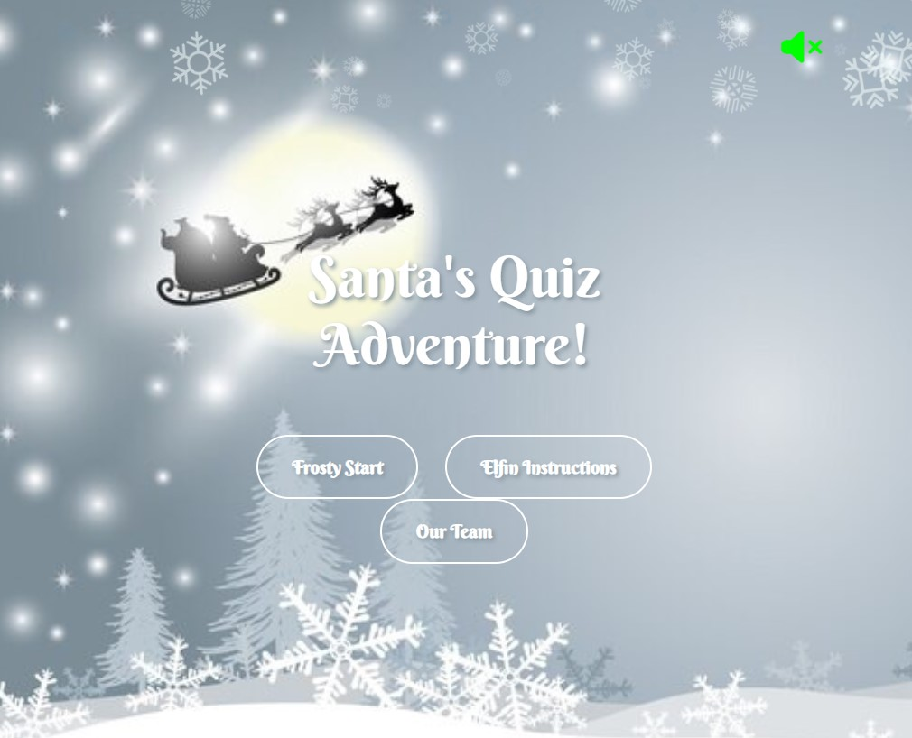

<h1 text-align="center">Manual Testing and Validation</h1>

# Test Cases

| ID | Test Subject | Steps Taken | Outcome Generated | Screenshot |
|----|--------------|-------------|-------------------| ---------- |
| 01 | Home page background | Check appearance of background | Background image is clear and snowfake effect is working | 
| 02 | Game Title | Check appearance of title | Title is clearly legible and appropriately positioned |
| 03 | Music Button | Check appearance and click button | Music plays when button is clicked, music stops when button is clicked again |
| 04 | Elfin Instructions Button | Check appearance and click button | Font is clearly legible, instruction modal appears when button is clicked |
| 05 | Elfin Instructions modal Titles | Check appearance of title | Font is clearly legible, title is appropriately positioned |
| 06 | Elfin Instructions modal Other Text | Check appearance of other text | Font is clearly legible, text is appropriately positioned |
| 07 | Elfin Instructions modal Symbols | Check appearance of star, tree and snowflake symbols | Symbols are clear, appropriately sized and positioned |
| 08 | Elfin Instructions modal Exit | Click 'X' in top right corner of the modal | ** |
| 09 | Elfin Instructions modal 'Ho-Ho Hurry' Button | Check appearance and click button | Font is clearly visible, button click opens difficulty selection modal |
| 10 | Frosty Start Button | Check appearance and click button | Font is clearly legible, button click leads to difficulty selection modal |
| 11 | Difficulty Modal | Check appearance of modal | All text is clearly legible and modal is appropriately sized positioned | 
| 12 | Difficulty Modal Exit | Click 'X' in corner of modal | Modal disappears and page returns to homepage |
| 13 | Difficulty Modal 'Jingle Bells Level' | Check appearance and click button | Font is clearly legible, leads to select topic modal |
| 14 | Difficulty Modal 'Frosty the Snowman Level' | Check appearance and click button | Font is clearly legible, leads to select topic modal |
| 15 | Difficulty Modal 'Santa's Workshop Challenge' Level | Check appearance and click button | Font is clearly legible, leads to select topic modal |
| 16 | Select Topic modal (Jingle bells level) | Check appearance of modal | Font is clearly legible, modal is appropriately positioned and sized |
| 17 | Select topic Buttons | Check appearance of buttons and click each | Font is clearly legible, each button leads to quiz on the topic chosen |
| 18 | Quiz - Christmas Trivia Quiz Background | Check appearance | Image is clear and does not affect readablity of game text |
| 19 | Quiz - back button | Check appearance and click button | Button is appropriately sized, leads back to home page with continue button appearing |
| 23 | Continue Button | Check appearance and click button | Button is appropriately sized and positioned, leads back to last point in quiz |
| 20 | Quiz - Music Button | Check appearance and click button | Music plays when button is clicked, music stops when button is clicked again |
| 21 | Quiz - Help Button | Check appearance and click button | Font is clearly legible, instruction modal appears when button is clicked |
| 22 | Quiz - Title | Check Appearance of Title | Title is clearly legible and appropriately sized and positioned |
| 23 | Quiz - Question | Check Appearance of Question | Title is clearly legible and appropriately sized and positioned, matches theme |
| 24 | Quiz - Answers Buttons | Check appearance and click button | Font is clearly legible, button click selects answer and moves to next question |
| 25 | Quiz - Attempts | Check appearance of Attempts section | All elements of attempts section are clearly visible |
| 26 | Quiz - Incorrect answer | Click incorrect answer | Moves onto next question, an attempt icon disappears |
| 27 | Quiz - Questions Counter | Answer question and move to next one | Question counter goes down |
| 28 | Quiz - Progress Bar | Answer question and move to next one | The sleigh icon moves along the progress bar |
| 29 | Quiz - No Attempts left | Run out of attempts | Modal appears |
| 30 | Game over Modal | Check appearance of modal | Text is legible, symbols are clear |
| 31 | Game over Buttons | Check appearance and click buttons | Buttons are clearly legible. Yes button returns to difficulty selection, No button returns to homepage with no continue button |
| 32 | Win Game modal | Check appearance of modal | Text is legible, symbols are clear, trophy animation is working |
| 33 | Win Game Buttons | Check appearance and click buttons | Buttons are clearly legible. Yes button returns to difficulty selection, No button returns to homepage with no continue button |

# Validation

## Validators used
- Javascript: [JsHint](https://jshint.com/)
- HTML: [W3C Validator](https://validator.w3.org/)
- CSS: [W3C CSS Validator](https://jigsaw.w3.org/css-validator/)

## Results

### db.js

### game-display.js
**

### game-storage.js

### game.js

### gameSnowflakes.js
**

### home.js

### homeSnowflakes.js
**

### modals.js

### script.js

# Bug Reports

## 1. 
Bug: When user returned to the home page from the game page, the continue button allowed the user to continue the game, even if the user had already finished the game.
Fix: The continue button is removed dynamically immediately when the user starts a new game

